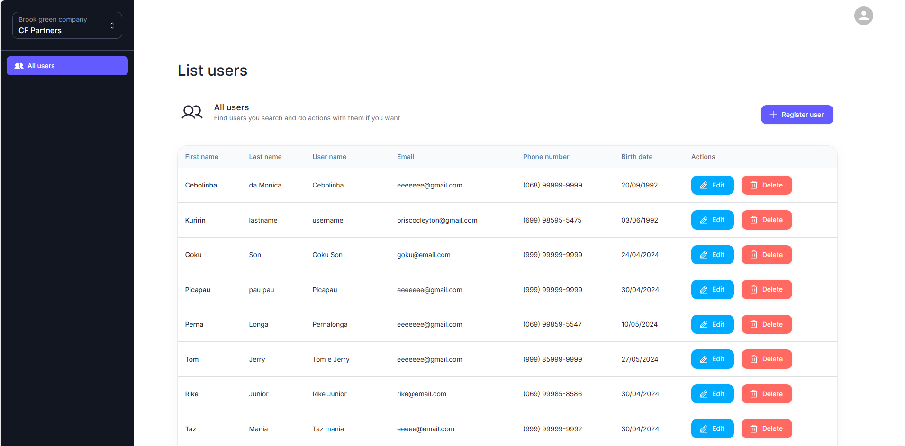
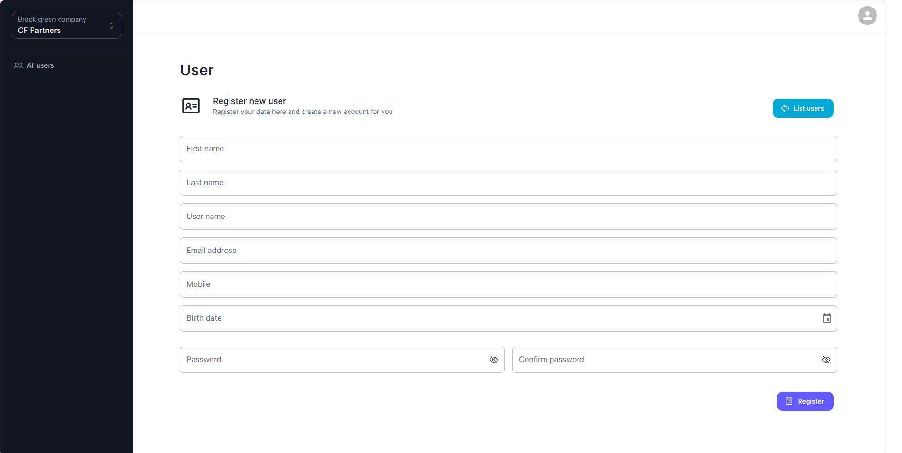
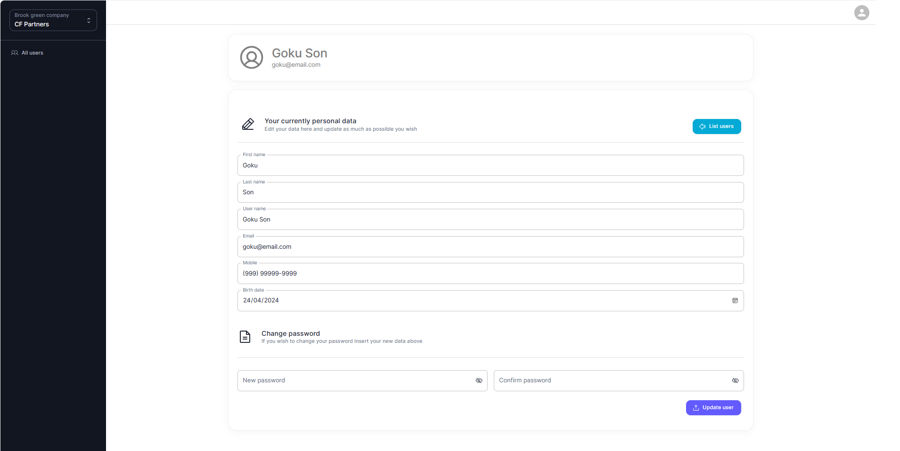

<!-- <h1 align="center">
    
</h1> -->


# Project CRUD Test CF Partners using NextJS 14

<p align="center">
 <a href="#-overview">Overview</a> /
 <a href="#-functionalities">Functionalities</a> /
 <a href="#-layout">Layout</a> /
 <a href="#-how-to-execute-the-project">How to run</a> / 
 <a href="#-technologies">Technologies</a> /
</p>


## 💻 Overview

The CF Partners CRUD test is a web project that consists of a user application used to create, read, update, and delete user information for managing user details and credentials within an application. The CRUD (Create, Read, Update, Delete) is a fundamental approach in software development, and its effective implementation is essential for the functionality and usability of many information systems. 

The CF Partners test demonstrates the practical application of these principles in a specific context, emphasizing the importance of robust and efficient user management.

Next.js is a popular React framework for building web applications. It is designed to make it easy to create server-rendered React applications and provides features like automatic code splitting, server-side rendering, and routing out of the box.


## ⚙️ Functionalities

- [x] Landing page and contact with the creator
- [x] Create: Register a new user inside our base data e with your personal data.
- [x] List: All users registered in this sistem are show up for the currently user.
- [x] Edit: If you are not satisfected, you can change data and do new uptades.
- [x] Delete: Are you not satisfected? Do not worry, you can delete you user.
- [x] Another funcionalities

---

## 🎨 Layout

### Web

<p align="center" style="display: flex; align-items: flex-start; justify-content: center;">
  
  <br>
  
   <br>
  
</p>


## 🚀 How to run

### Prerequisites

Before starting, you will need to have the following tools installed on your machine:
 - Node.js
 - The npm versions are up to date

#### 🧭 Running the web application

```bash

# Clone this repository
$ git clone https://github.com/carloshenriquefarias/teste-cfpartners.git

# Do not forget it
$ Make sure your Node.js and npm versions are up to date

# Install dependencies
$ npm install or yarn install

# Start the server
$ npm run dev or yarn dev

The application will open on port:3000 - access http://localhost:3000

To set up the application go to folder SERVICES, the file api.ts you can use to set up your API - Ex: http://localhost:8080

```

### Access
After installing the application, you can access it on your local environment by navigating to this url:
``http://localhost:3000``


## 🛠 Technologies

The following tools were used to build the project:

#### **Website**  ([NextJS 14](https://reactjs.org/)  +  [TypeScript](https://www.typescriptlang.org/))

-   **[React Router Dom](https://github.com/ReactTraining/react-router/tree/master/packages/react-router-dom)**
-   **[Phosphor Icons](https://phosphoricons.com/)**
-   **[Axios](https://github.com/axios/axios)**
-   **[Material UI](https://mui.com/material-ui/all-components/)**
-   **[React-hook-form](https://react-hook-form.com/)**
-   **[Zod](https://zod.dev/)**
-   **[React Toastify](https://www.npmjs.com/package/react-toastify)**

## 💻 Contact Us

- Email Us: carloshenriquepvh@hotmail.com

